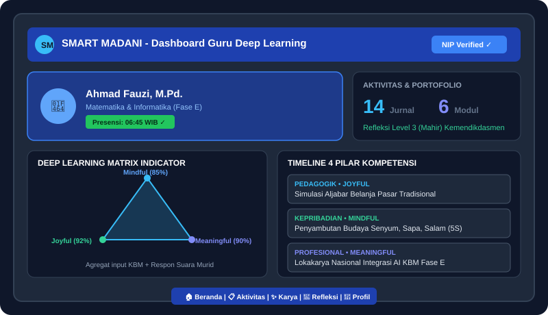
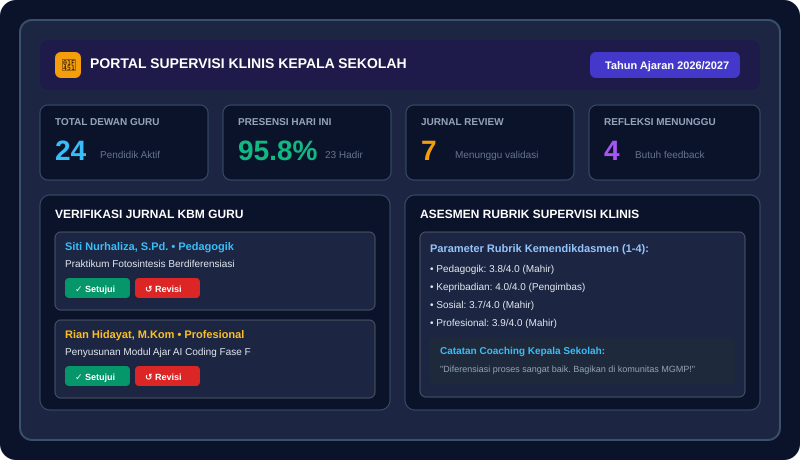
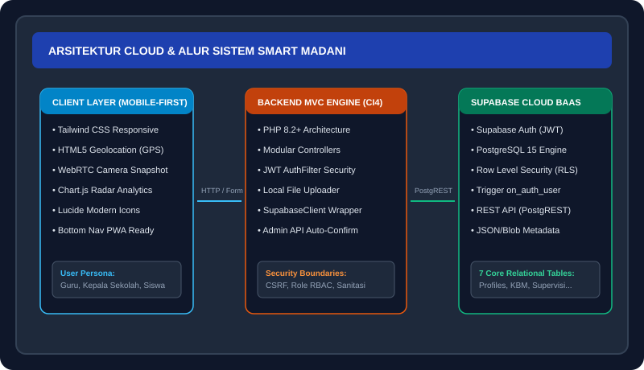

# SMART MADANI (Sistem Manajemen Aktivitas, Refleksi, dan Talenta Guru)

Platform digital manajemen kinerja, repositori karya pedagogis, dan supervisi klinis kepala sekolah berbasis **Paradigma Deep Learning (Mindful, Meaningful, Joyful Learning)** yang terintegrasi dengan standar rubrik kompetensi nasional **Kemendikdasmen RI**.

---

## Preview Tampilan Aplikasi

### 1. Dashboard Guru & Deep Learning Radar Chart
Visualisasi keseimbangan 3 pilar Deep Learning secara realtime dari agregat jurnal mengajar dan suara murid.


### 2. Portal Supervisi Klinis Kepala Sekolah
Dashboard monitoring kehadiran dewan guru, verifikasi berkas jurnal KBM, umpan balik refleksi, dan penerbitan asesmen supervisi 4 pilar.


### 3. Arsitektur Cloud & Alur Sistem
Sistem hybrid terintegrasi antara CodeIgniter 4 MVC dan Supabase Cloud BaaS.


---

## Pilar & Paradigma Deep Learning Kemendikdasmen

Sesuai pendekatan Kemendikdasmen (Pendekatan Mendikdasmen Abdul Mu'ti), pembelajaran berpusat pada 3 pilar:
1. **Mindful Learning**: Kesadaran penuh guru dan murid terhadap tujuan KBM, keterlibatan aktif, dan diferensiasi kebutuhan siswa.
2. **Meaningful Learning**: Materi dikaitkan langsung dengan konteks kehidupan nyata, pemecahan masalah konkret, dan interkoneksi lintas disiplin ilmu.
3. **Joyful Learning**: Suasana belajar partisipatif, eksploratif, minim tekanan toksik, dan menumbuhkan rasa ingin tahu alamiah.

Matriks Refleksi Kompetensi Guru:
- **Level 1 (Berkembang)**: Menyadari kelemahan metode sendiri & mulai merefleksikan kebutuhan murid.
- **Level 2 (Berdaya)**: Mampu mengidentifikasi solusi konkrit dan mencoba metode baru di kelas.
- **Level 3 (Mahir)**: Mampu mengevaluasi dampak metode terhadap keterlibatan dan pemahaman siswa.
- **Level 4 (Pengimbas)**: Mampu membimbing rekan guru sejawat dan mereplikasi praktik baik (Good Practice).

---

## Modul Fitur Utama

### A. Fitur Guru (Pendidik)
- **Smart Attendance**: Presensi mandiri berbasis GPS HTML5 Geolocation + verifikasi swafoto kamera browser instan.
- **Our Activity**: Jurnal harian KBM 4 pilar kompetensi (*Pedagogik, Kepribadian, Sosial, Profesional*) dilengkapi tagging pilar Deep Learning.
- **Our Creativity**: E-Library repositori karya (Modul Ajar Deep Learning, Video Pembelajaran embed, LKPD kontekstual) dengan sistem apresiasi (*Like*).
- **Our Refleksi**: Refleksi terstruktur pasca-KBM (*Situasi, Tantangan, Aksi Perbaikan, & Self-Assessment Level 1-4*).
- **Student Feedback Pulse**: Instrumen micro-survey cepat 3 pilar untuk siswa via QR Code tanpa perlu login.
- **Digital Teaching Portfolio (e-CV)**: Kartu portofolio publik guru yang tervalidasi dan siap cetak/simpan PDF untuk PKB.

### B. Fitur Kepala Sekolah / Supervisor
- **Executive Monitoring**: Monitoring persentase kehadiran guru harian dan jumlah KBM terlaksana secara realtime.
- **Verifikasi Jurnal KBM**: Memberikan persetujuan (*Approve*) atau arahan perbaikan (*Revision*) pada aktivitas guru.
- **Coaching & Feedback Refleksi**: Memberikan dialog apresiatif dan saran perbaikan terhadap refleksi KBM guru.
- **Supervisi Klinis KBM**: Rubrik asesmen standar (skor 1.0 - 4.0) per 4 pilar kompetensi nasional plus indeks keterlaksanaan Deep Learning.

---

## Tech Stack & Arsitektur

- **Backend Engine**: CodeIgniter 4 (PHP 8.2+) dengan arsitektur MVC modular.
- **Cloud Database & Auth**: Supabase (PostgreSQL 15+, Supabase Auth JWT, Row-Level Security / RLS, PostgREST API).
- **Frontend & Styling**: Tailwind CSS (Mobile-First responsive theme), Lucide Icons, Chart.js Radar Matrix.
- **Storage**: Media lampiran diunggah ke storage lokal server dengan referensi path di database Supabase.

---

## Panduan Instalasi & Menjalankan Aplikasi

### 1. Kebutuhan Sistem
- PHP 8.2 atau lebih baru (ekstensi aktif: `curl`, `intl`, `mbstring`, `openssl`).
- Web Server: Apache (XAMPP/Laragon).
- Akun Supabase (Free Tier / Pro).

### 2. Clone Repository
```bash
git clone https://github.com/bradyivanilov/smart-mdn.git
cd smart-mdn
```

### 3. Setup Konfigurasi Database (.env)
Salin konfigurasi environment atau buat file `.env` di direktori root:
```ini
CI_ENVIRONMENT = development
app.baseURL = 'http://localhost/smart-madani/public/'
app.indexPage = ''

# Kredensial Supabase Project Anda
SUPABASE_URL = 'https://ufobfvehonpcoybpatbr.supabase.co'
SUPABASE_ANON_KEY = 'eyJhbGciOiJIUzI1NiIsInR5cCI6IkpXVCJ9...'
SUPABASE_SERVICE_KEY = 'eyJhbGciOiJIUzI1NiIsInR5cCI6IkpXVCJ9...'
```

### 4. Eksekusi Skema Database di Supabase
1. Buka dashboard Supabase project Anda: **SQL Editor** -> **New Query**.
2. Buka file `app/Database/supabase_schema.sql`.
3. Salin seluruh isi SQL ke editor Supabase dan klik **Run**.
4. Skema 7 tabel utama, trigger auto-profile, dan RLS security policies akan terpasang otomatis.

### 5. Akses Aplikasi
Jalankan Apache di XAMPP, lalu buka browser:
- **Pendaftaran Akun Baru**: `http://localhost/smart-madani/public/register`
  *(Pilih peran sebagai Guru atau Kepala Sekolah)*
- **Halaman Masuk**: `http://localhost/smart-madani/public/login`
- **Suara Murid (Publik via QR)**: `http://localhost/smart-madani/public/pulse/{user_id}`
- **e-CV Portofolio Guru**: `http://localhost/smart-madani/public/portfolio/{nip}`

---

## Struktur Direktori Proyek

```
smart-madani/
├── app/
│   ├── Config/              # Routing & Filter Configuration
│   ├── Controllers/         # Auth, Dashboard, Attendance, Activity, Creativity, Reflection, Supervisor
│   ├── Database/
│   │   └── supabase_schema.sql  # Skema Master PostgreSQL Supabase
│   ├── Filters/             # AuthFilter (JWT Session Validator)
│   ├── Libraries/
│   │   └── SupabaseClient.php   # Native Wrapper Supabase Auth & PostgREST
│   └── Views/               # Antarmuka Responsif (Tailwind CSS)
│       ├── activity/        # Jurnal 4 Kompetensi
│       ├── attendance/      # Kamera Swafoto & GPS
│       ├── auth/            # Form Login & Register Auto-Confirm
│       ├── creativity/      # E-Library Modul & Video Ajar
│       ├── dashboard/       # Deep Learning Radar Matrix Chart
│       ├── layouts/         # Master Layout & Bottom Navigation
│       ├── profile/         # Profil & e-CV Guru
│       ├── reflection/      # Refleksi Kemendikdasmen & Pulse Murid
│       └── supervisor/      # Portal Asesmen Kepala Sekolah
├── public/
│   ├── docs/images/         # Preview visual diagram & screenshot UI
│   └── uploads/             # Direktori berkas bukti & foto presensi
└── README.md
```

---

## Lisensi & Kontribusi
Dikembangkan untuk mendukung akselerasi transformasi digital dan peningkatan mutu pendidik di bawah kerangka Kurikulum Nasional Kemendikdasmen RI.
Open source di bawah lisensi MIT.
